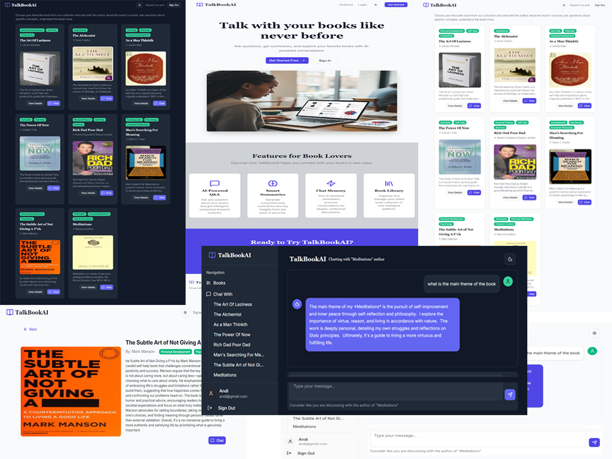

# 📚 TalkBookAI

**TalkBookAI** lets readers *chat with books*—literally. Log in, pick a book from the list, and start a conversation with an AI that responds in the voice of the author, drawing from the book’s content and your ongoing chat history. It’s like having a personal dialogue with literary legends.

---

## 🧠 Tech Stack

### Backend (`/backend`)

- **FastAPI** – blazing-fast Python API framework  
- **MongoDB Atlas** – document storage + vector search  
- **LangChain** – orchestrates RAG (Retrieval-Augmented Generation) pipelines  
- **Gemini API** – powers LLM responses and embeddings  
- **JWT Auth** – secure session management with HTTP-only cookies  
- **Docker + Render** – containerized deployment  

### Frontend (`/frontend`)

- **React Router v7 (Framework Mode)** – SPA routing & nested layouts  
- **Tailwind CSS + ShadCN UI** – modern styling and accessible components  
- **Vercel** – lightning-fast global deployment  

---

## ✨ Features

- 🔐 **Authentication** – JWT stored in HTTP-only cookies  
- 📖 **Book Selection** – choose from a curated library  
- 🧑‍💬 **Conversational AI** – responds in the *voice* of the author  
- 🧠 **Memory** – contextual replies based on previous chat turns  
- 📄 **PDF Ingestion** – onboard new books with an ingestion script  
- 🌍 **CORS-Enabled** – secure frontend-backend communication  

---

## 🚀 Getting Started

### Prerequisites

- Python 3.11+  
- Node.js 22+  
- Docker *(optional, for containerized setup)*  
- MongoDB Atlas account  
- Gemini API key  

---

### Backend Setup

```bash
cd backend
python -m venv venv
source venv/bin/activate   # Windows: venv\Scripts\activate
pip install -r requirements.txt

# .env file variables:
# MONGODB_URI=
# GOOGLE_API_KEY=
# SECRET_KEY=
# DB_NAME=
# FRONTEND_URL=

fastapi dev
````

#### (Optional) Docker Workflow

```bash
cd backend
docker build -t talkbookai-backend .
docker run -p 8000:8000 --env-file .env talkbookai-backend
```

> Uses a minimal **python:3.11-slim** base and launches `uvicorn main:app --host 0.0.0.0 --port 8000`.

---

### Frontend Setup

```bash
cd frontend
npm install

# .env file variables:
# VITE_BACKENDURL=

npm run dev
```

---

## 🧪 PDF Ingestion

To ingest a new book:

```bash
cd backend
python ingestion_handler.py   # or: py -m ingestion_handler
```

The script:

- Extracts and chunks the text
- Generates embeddings via **Gemini**
- Stores metadata and vectors in **MongoDB**

---

## 🛡️ Security Notes

- JWTs are stored in **HTTP-only cookies** to mitigate XSS attacks
- CORS configured for safe cross-origin requests (Vercel ↔ Render)
- Secrets managed in `.env` files (never committed to version control)

---

## Screenshot



---

## 📈 Roadmap

- [ ] Chapter-specific context retrieval
- [ ] Multi-author personality modes

---

## 📄 License

MIT License
